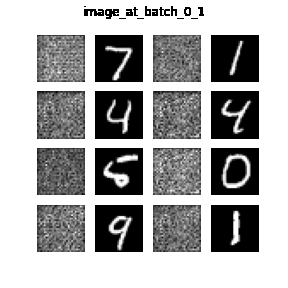

# Variational AutoEncoder(VAE) implemented with tensorflow 2

## Description
Auto-Encoding Variational Bayes[ [link](https://arxiv.org/abs/1312.6114)]

## structure

```
.
└── img/
    ├── image_at_epoch_{num}.png       # Generated image at epoch {num}
    ├── ...
    └── vae.gif                        # Animation of generated images
└── utils/           
    ├── __init__.py
    ├── callback.py                    # Custom callback function
    ├── layers.py                      # Encoder, Decoder implement
    ├── model.py                       # VAE implement
    └── utils.py                       # Other functions to draw a plot
├── .gitignore         
├── requirements.txt                
├── VAE.ipynb                          # Examples of progress 
└── VAE.py                             # model training and save weight py
```

## Usage

```
python VAE.py --LATENT_DIM=2 --epoch=5 --batch=512 --lr=0.0001 --fig_save=False --model_save=False
```

--LATENT_DIM : latent represent dimmension(int, default=2)
--epoch : number of epoch(int, default=5)
--batch : batch size(int, default=512)
--lr : learning rate(float, default=1e-4)
--fig_save : Whether to save the generated image(bool, default=False)
--model_save : Whether to save the generated model(bool, default=False)

## Result
+ Generated image


## reference
Kingma, Diederik P., and Max Welling. "Auto-encoding variational bayes." arXiv preprint arXiv:1312.6114 (2013).